# Setup Guide

Hey there students that attened the STEM Camp! This is the code on your car it is pretty easy to get set up just expand the tabs and follow the instructions below.

Git

<H4>Download</H4>

https://git-scm.com/downloads
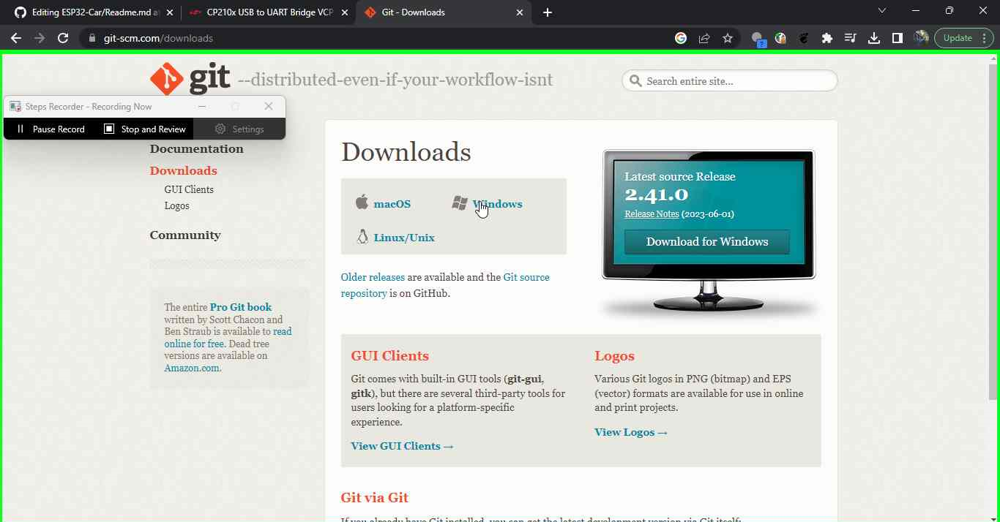

<H4>Install</H4>

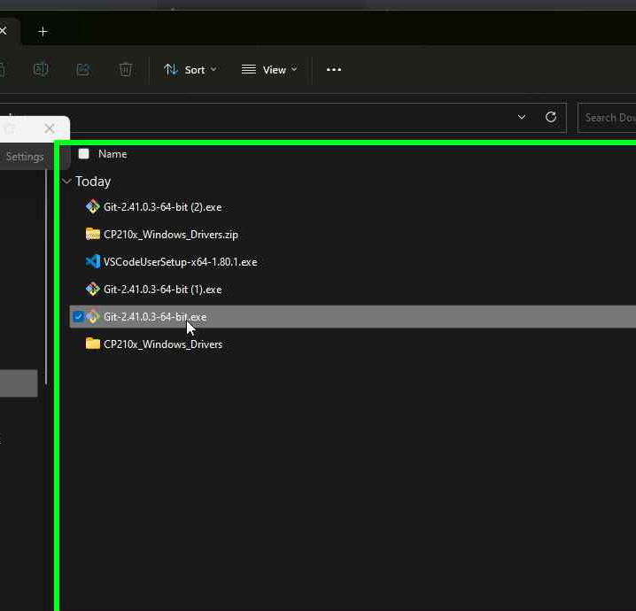
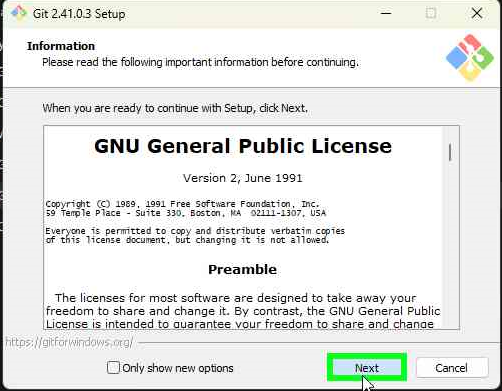

Driver

<H4>Download</H4>

<https://code.visualstudio.com/download>
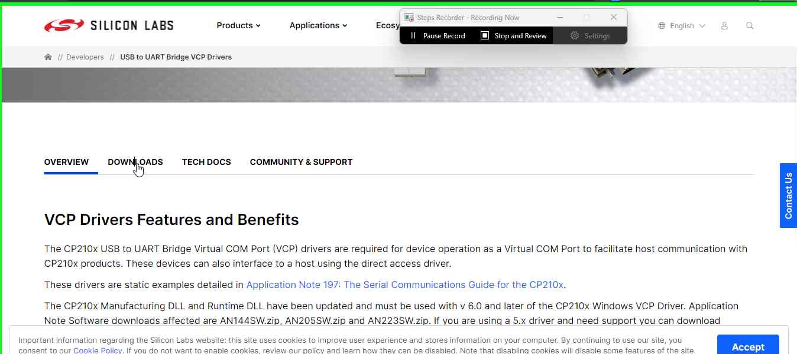
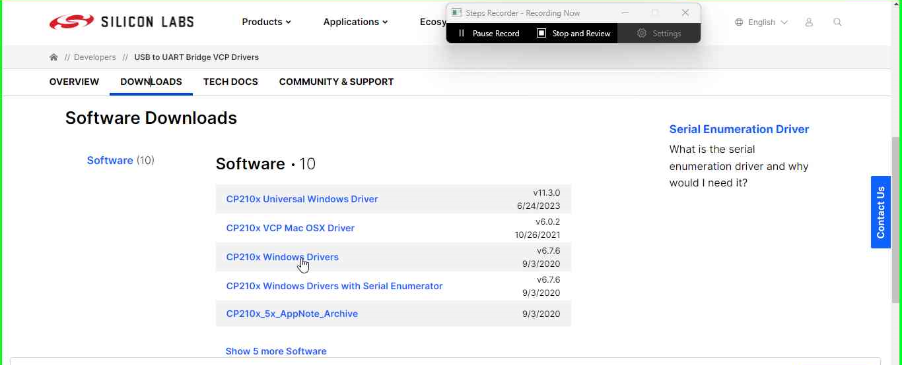

<H4>Install</H4>

Right click the downloaded file then Extract the zip

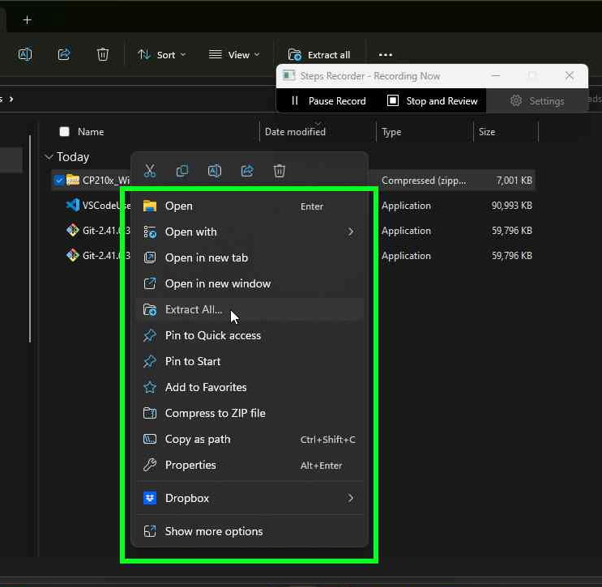
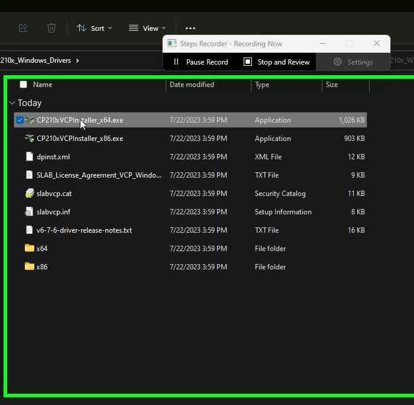
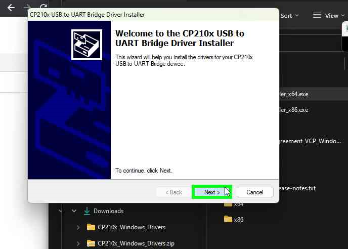

VSCode

<H4>Download</H4>

https://code.visualstudio.com/download
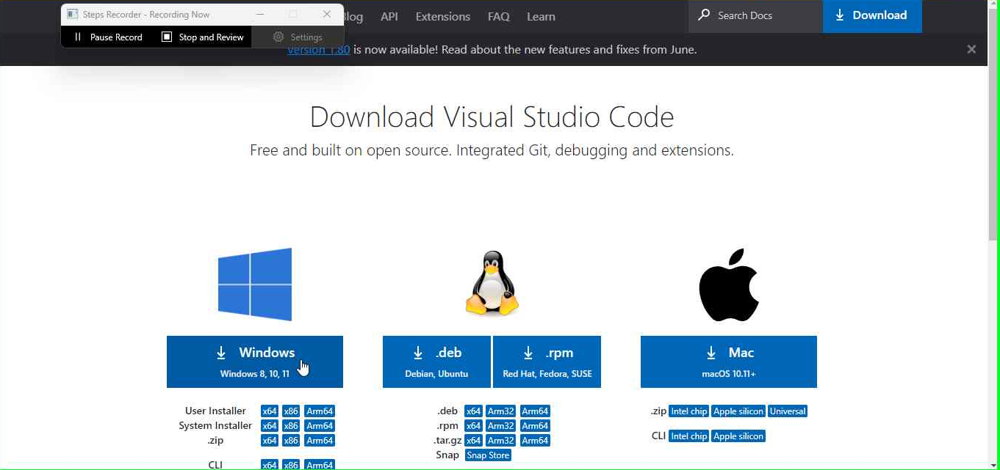

<H4>Install</H4>

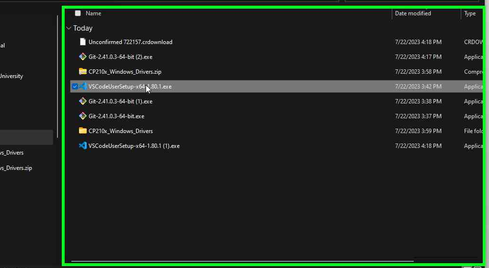
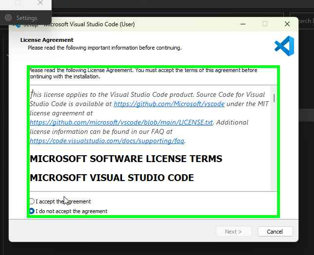

Clone Code

Open powershell by using search and typing powershell
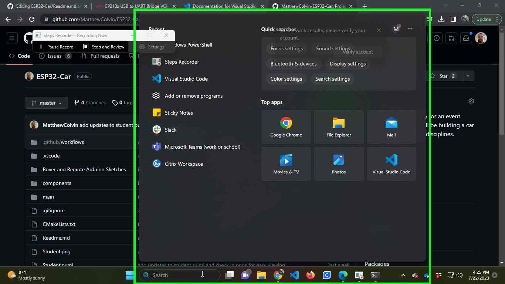

Copy and paste this into powershell then press enter

    cd ./Documents/
    git clone https://github.com/MatthewColvin/ESP32-Car.git

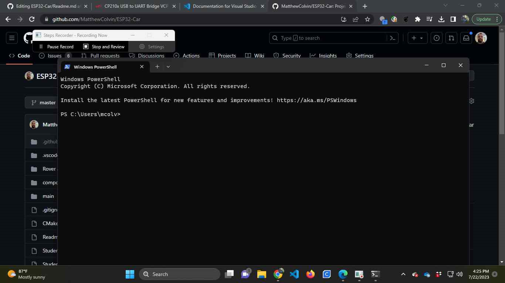

Open the code by pasting this into powershell
    
    code ./ESP32_Car/

Open the terminal inside vscode by pressing the button circled in red and copy this into the terminal

    git checkout event/softwareTemplate

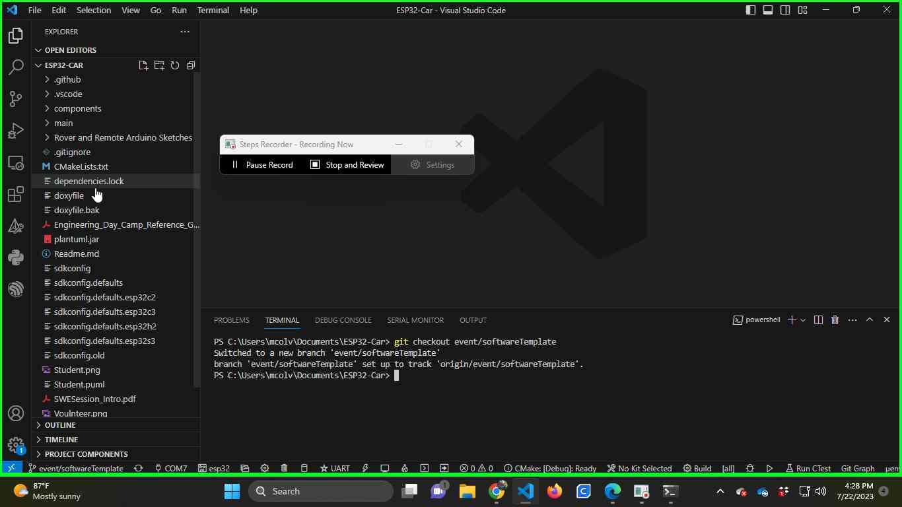

Open up the main to start writing code or copy and paste your file into this folder.

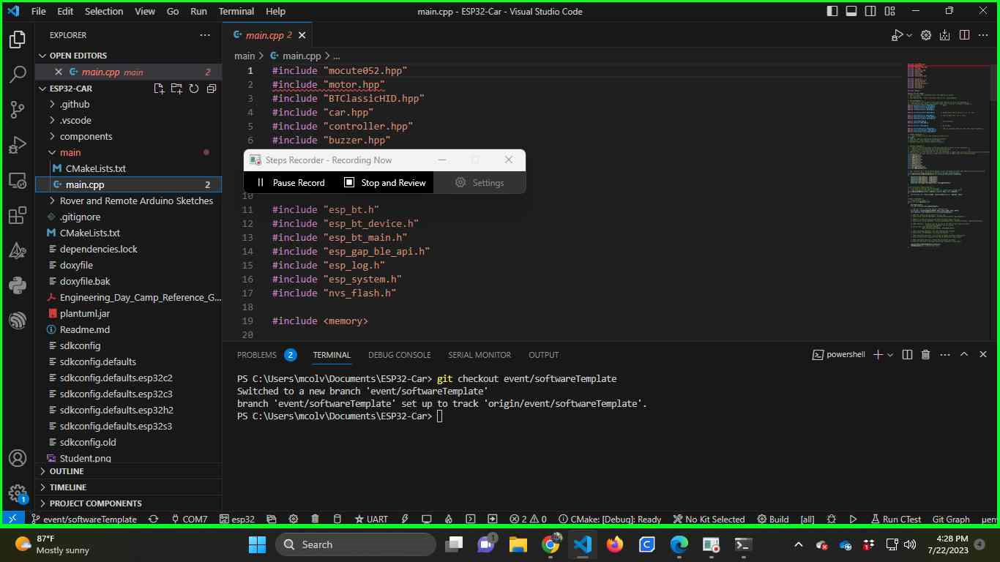

Install Extension

